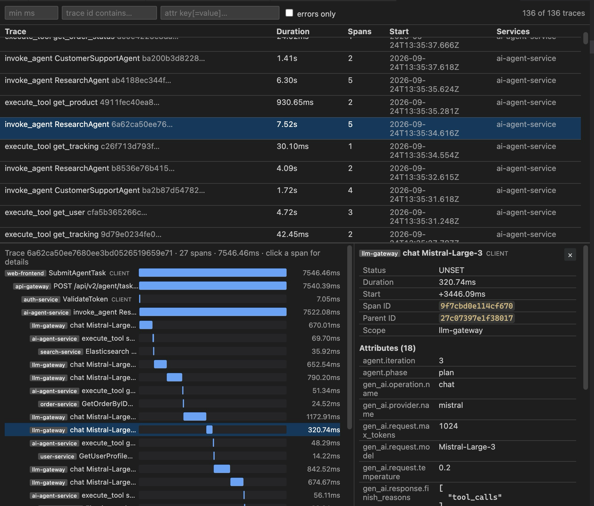
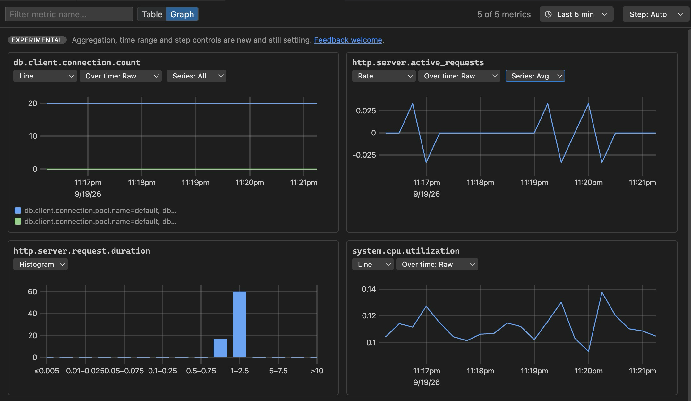
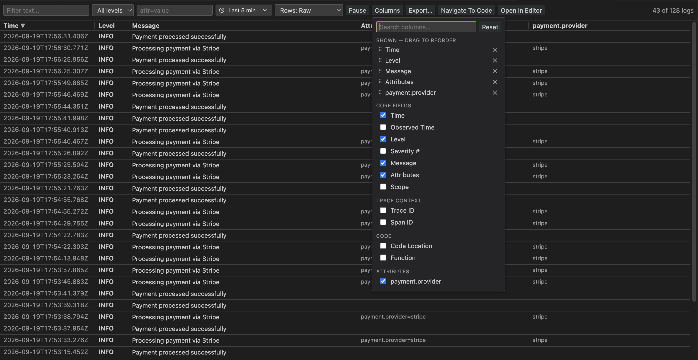
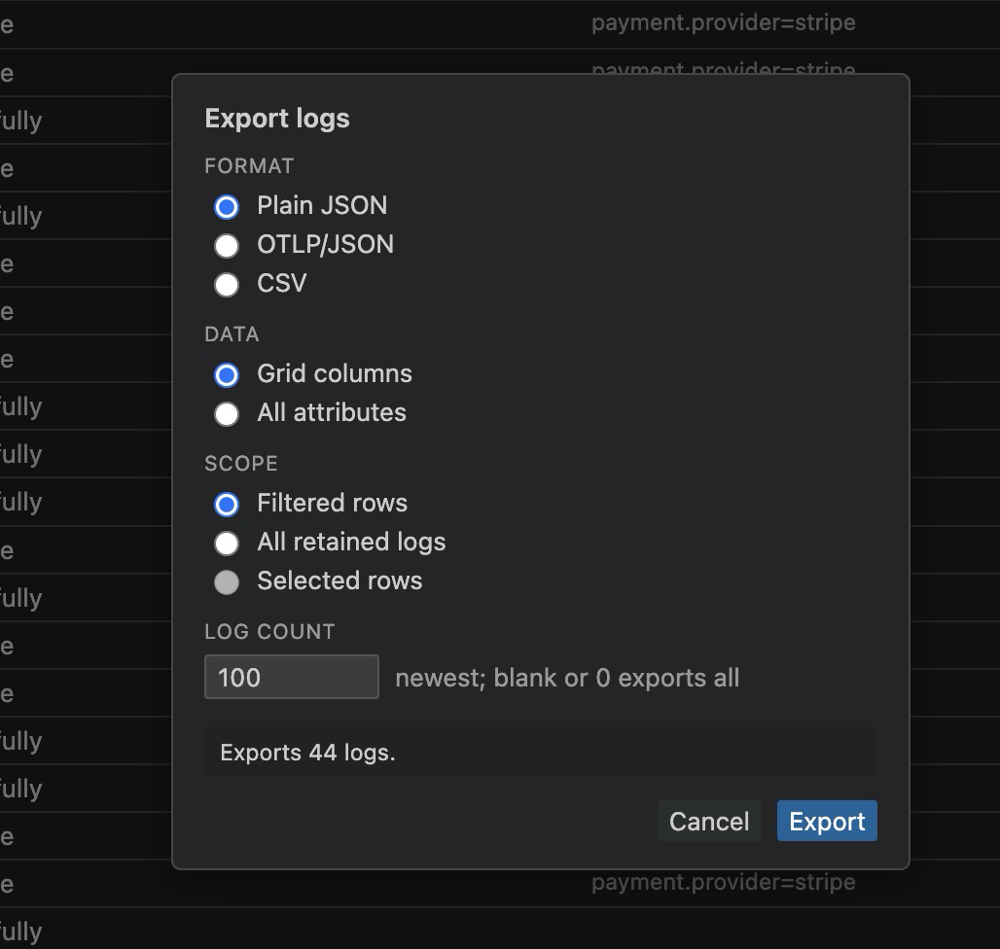
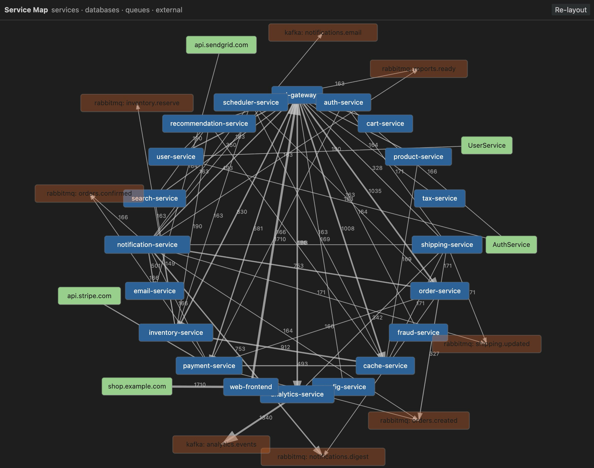

# OpenTelemetry for VS Code

This extension brings **OpenTelemetry** debugging directly into VS Code. It runs a local **OTLP
receiver** inside the editor that collects **logs, traces, metrics, and service relationships**
from any application that exports OpenTelemetry data — whether the app is launched from VS Code or
run entirely outside it.

There's nothing else to install and run: no Jaeger, no Zipkin, no OpenTelemetry Collector, and no
extra containers. Point any OTLP-compatible SDK at the receiver and your telemetry appears in the
editor, grouped by service and instance. Data is kept **in memory** and cleared when the receiver
restarts.

[](https://marketplace.visualstudio.com/items?itemName=SukantaSaha.opentelemetry)
[](https://github.com/sukanta1991/opentelemetry/actions/workflows/ci.yml)


## Preview

Traces & spans — find slow or failing requests and examine them in a waterfall timeline:



Metrics — gauges, counters, and histograms per service instance. The **Graph** view renders each
metric as a chart, with per-graph dropdowns for the chart type (scoped to the metric's OTEL type),
the **Over time** aggregation, and the **Series** roll-up, plus a shared time range and step:



Logs — search and filter, choose which columns to show (including any attribute promoted to its
own sortable column), then jump straight to the source line:



Export the rows you care about as OTLP/JSON, plain JSON, or CSV — picking the columns, the record
count, and whether to export the filtered, all, or selected rows:



Service map — services, databases, queues, and external dependencies inferred from spans:



## What this extension does

- **Embedded OTLP receiver** — accepts **OTLP/gRPC** (default `4317`) and **OTLP/HTTP**
  (protobuf + JSON, default `4318`).
- **Logs** — a virtualized table that stays responsive at full retention:
  - **Search and filter** by text, minimum level, and `attr=value`.
  - **Time range picker** (1 min … 2 hour, or **All logs**) anchored to the newest log
    received, so rows stay visible after the emitting app stops. A hint appears when retention
    holds less history than the selected window.
  - **Columns** button to choose which of Time, Observed Time, Level, Severity #, Message,
    Attributes, Scope, Trace ID, Span ID, Code Location and Function are shown — plus any
    **individual log attribute** promoted to its own sortable column. Drag to reorder,
    search the list, or reset to defaults.
  - **Resizable columns** — drag any edge, or double-click it to fit the content.
  - **Row height** modes: Raw (full wrap), 1 line, 2 lines, and Condensed.
  - **Sorting** by Time, Observed Time, Severity, or an attribute column. Newest first by default.
  - **Pause** freezes the view while logs keep arriving in the background, showing how many
    are queued.
  - **Multi-select** with Cmd/Ctrl+click, Shift+click ranges, and Cmd/Ctrl+A, with an optional
    selection checkbox column.
  - **Export** to OTLP/JSON, plain JSON, or CSV — choosing the visible columns or all
    attributes, a record count, and whether to export the filtered, all, or selected rows.
  - **Import** OTLP/JSON, JSON Lines (`.jsonl`/`.ndjson`) or previously exported plain JSON as a read-only instance under the **Imported** node, kept separate from live telemetry.
  - **Navigate To Code** to jump to the source line, and **Open In Editor** to view a log as JSON.
- **Traces & spans** — filter by duration, trace ID, or errors, and **Examine** any trace as a
  span waterfall. Distributed spans are merged by trace ID.
- **Metrics** — per-instance gauges, counters/sums, and histograms with a **Table | Graph**
  toggle. The Graph view plots time-series history built up as telemetry streams in:
  - **Gauges & sums** → multi-series line charts (one line per attribute set), on a shared time axis.
  - **Summaries** → a line per quantile.
  - **Histograms** → bar charts of the latest bucket distribution.
  - A **per-graph chart-type dropdown** offers views scoped to each metric's OTEL type —
    counters and updown-counters add **rate**, **stacked-area**, **area**, and **bar** (for
    updown-counters `rate` keeps real increases and decreases); gauges add a single-value
    **gauge** readout; summaries add a **percentile** view; every type offers **table**. The
    selection is remembered per metric across panel reopens.
  - An **Over time** dropdown aggregates each series into fixed-width time buckets
    (avg / min / max / sum / last / count / std-dev / P50 / P90 / P95 / P99), reshaping the
    plotted line rather than adding a readout; **Raw** plots every sample. Multi-series scalar
    metrics also get a **Series** dropdown (sum / avg / min / max / P95 across label sets).
  - A **time-range picker** in the toolbar (1 min … 2 hour) applies to every graph at once and
    pins the x-axis to the selected window, alongside a **Step** control for the aggregation
    bucket width. **Auto** follows the range; pick a coarser step to gather several samples per
    bucket. The width actually used is shown beside the Over time dropdown. A hint appears when
    the retained history is shorter than the chosen range.
  - ⚠️ The aggregation, time-range and step controls are **experimental** while we gather
    feedback — their defaults and behaviour may change. Please report anything surprising at
    [github.com/sukanta1991/opentelemetry/issues](https://github.com/sukanta1991/opentelemetry/issues).
  - Charts use VS Code theme colors, abbreviate large axis values (e.g. `270k`, `2.8M`), and
    truncate long series labels with a full-text tooltip on hover. History depth is bounded by
    `otel.retention.maxMetricPointsPerSeries`.
- **Service map** — services, databases, queues, and external dependencies inferred from spans.
- **Instances tree** — applications grouped by `service.name`, each with its own instances.

Works with any OTLP-compatible SDK — **Java, .NET, Go, Node.js, Python, Rust**, and others.

## Getting started

1. **Install** from the Extensions view (search “OpenTelemetry”), or from a terminal:

   ```bash
   code --install-extension SukantaSaha.opentelemetry
   ```

2. Open the **OpenTelemetry** view in the Activity Bar and click **Start receiver** (or start it from the status bar item). The status bar then shows the active gRPC and HTTP ports.

3. Point your application's OTLP exporter at the receiver. Its instance, logs, traces, and metrics
   appear as data arrives.

### Apps launched from VS Code

When you run or debug an app from VS Code, the extension automatically injects the
`OTEL_EXPORTER_OTLP_ENDPOINT` environment variable so a configured OTLP exporter sends data to the
receiver. You can disable this with the `otel.overwriteEnvVars` setting.

### Apps running outside VS Code

Point the exporter at the receiver yourself. Use the **OpenTelemetry: Copy OTLP Endpoint** or
**Copy OTLP Endpoint Environment Variable** commands (or **Show Instrumentation Snippet** for a
per-language example), then set:

```bash
export OTEL_EXPORTER_OTLP_ENDPOINT="http://127.0.0.1:4317"
export OTEL_EXPORTER_OTLP_PROTOCOL="grpc"
```

You can also route data through an
[OpenTelemetry Collector](https://opentelemetry.io/docs/collector/) by adding the receiver as an
OTLP exporter target.

## Common workflows

**Debug a failing request**

1. Start your app and generate some traffic.
2. Open **Traces**, tick **errors only**, and select the failed trace.
3. Click **Examine** to open the span waterfall and find the slow or failing span.
4. Open **Logs**, filter by text or level, and use **Navigate To Code** to jump to the source.

**Share a log sample with a teammate**

1. Open **Logs** and narrow the table with the search, level, attribute, and time-range controls.
2. Optionally select specific rows (Cmd/Ctrl+click, or Shift+click for a range).
3. Click **Export…**, pick a format and scope, and save the file.
4. Your teammate runs **OpenTelemetry: Import Logs From File** to open it under **Imported** —
   read-only, retention-exempt, and unaffected by **Clear Collected Data**.

**Bring in logs from another vendor**

1. Export logs from your log platform as JSON Lines (one JSON object per line, `.jsonl`/`.ndjson`).
2. Run **OpenTelemetry: Import Logs From File** and pick the file.
3. Nested objects are flattened to dotted attribute keys, and the timestamp, severity, message,
   trace/span ids, scope, and service name are recognised from common field names — epochs in
   seconds, milliseconds, microseconds, or nanoseconds are all detected automatically.
   Unreadable lines are skipped and counted rather than failing the whole import.

**Understand what a service talks to**

1. Generate distributed traffic (HTTP calls, database queries, queue messages).
2. Open the **Service Map** to see services, databases, and queues and how they connect.

## Commands

| Command | Description |
| --- | --- |
| `OpenTelemetry: Start / Stop / Restart Receiver` | Control the embedded OTLP receiver. |
| `OpenTelemetry: Clear Collected Data` | Drop all in-memory telemetry. |
| `OpenTelemetry: Copy OTLP Endpoint` | Copy the gRPC or HTTP endpoint. |
| `OpenTelemetry: Copy OTLP Endpoint Environment Variable` | Copy `OTEL_EXPORTER_OTLP_ENDPOINT=…`. |
| `OpenTelemetry: Open Terminal With OTLP Environment` | New terminal pre-set with the OTLP env vars. |
| `OpenTelemetry: Show Instrumentation Snippet` | Per-language exporter snippets (Node/Python/Go/.NET/Java). |
| `OpenTelemetry: Open Logs / Traces / Metrics` | Open a panel for the selected instance. |
| `OpenTelemetry: Export Logs` | Export logs as OTLP/JSON, plain JSON, or CSV. |
| `OpenTelemetry: Import Logs From File` | Load an OTLP/JSON, JSON Lines (`.jsonl`/`.ndjson`) or exported plain JSON file as a read-only instance. |
| `OpenTelemetry: Open Service Map` | Show the service dependency graph. |

Instances in the tree also expose inline **Logs / Traces / Metrics** icons and a **Remove
Instance** action.

## Settings

| Setting | Default | Description |
| --- | --- | --- |
| `otel.launchOnStartup` | `false` | Start the receiver when VS Code starts. |
| `otel.port.mode` | `fixed` | `fixed` or `random` port assignment. |
| `otel.port.grpc` | `4317` | OTLP/gRPC port (fixed mode). |
| `otel.port.http` | `4318` | OTLP/HTTP port (fixed mode). |
| `otel.host` | `127.0.0.1` | Bind address. Binding beyond localhost exposes telemetry. |
| `otel.overwriteEnvVars` | `true` | Inject the OTLP endpoint into launch/debug configs. |
| `otel.retention.maxLogsPerInstance` | `5000` | Log retention cap per instance. |
| `otel.retention.maxTracesPerInstance` | `2000` | Trace retention cap per instance. |
| `otel.retention.maxMetricPointsPerSeries` | `500` | Metric time-series points retained per series (controls graph history depth). |
| `otel.import.maxFileSize` | `200` | Largest log file (MB) accepted by **Import Logs**. Checked before the file is read. |
| `otel.import.maxRecords` | `50000` | Most records accepted from one import. Imported logs bypass retention, so this bounds their memory use. |

Example `settings.json`:

```json
{
  "otel.launchOnStartup": true,
  "otel.port.mode": "fixed",
  "otel.port.grpc": 4317,
  "otel.port.http": 4318
}
```

## Troubleshooting

### The Instances view says the receiver isn't running

The receiver does not start automatically by default. Click **Start receiver** in the Instances
view (or the status bar), or set `otel.launchOnStartup` to `true` to start it whenever VS Code
launches.

### "Port already in use"

If the configured port is busy, the extension reports the error and offers to retry on randomly
assigned ports. You can also set `otel.port.mode` to `random`, or change `otel.port.grpc` /
`otel.port.http` to free ports.

### No telemetry appears

- Confirm the exporter endpoint matches the receiver: **gRPC** uses `4317`, **HTTP** uses `4318`.
  Set `OTEL_EXPORTER_OTLP_PROTOCOL` (`grpc` or `http/protobuf`) accordingly.
- For apps launched from VS Code, make sure `otel.overwriteEnvVars` is `true`.
- For external apps, copy the endpoint with **OpenTelemetry: Copy OTLP Endpoint** and verify your
  SDK is actually exporting.

> **Note:** the receiver binds to `127.0.0.1` by default. A firewall prompt may appear the first
> time it starts.

### "Navigate To Code" doesn't jump anywhere

Navigate To Code applies to **log entries** and requires source-location attributes
(`code.filepath` / `code.lineno`) on the log record. If those attributes aren't present, the
action is unavailable. It also can't navigate to third-party or decompiled code.

### My collected data disappeared

Live telemetry is stored **in memory** and is cleared when the receiver restarts or when you run
**Clear Collected Data**. To keep a copy, use **Export…** in the Logs panel and re-open it later
with **Import Logs From File** — imported instances survive **Clear Collected Data** and are only
removed explicitly.

### The settings gear opens an empty page

This was fixed in `0.1.2`. Update to the latest version, or open settings manually and search for
“OpenTelemetry”.

## Roadmap

Planned and under exploration — feedback welcome via
[issues](https://github.com/sukanta1991/opentelemetry/issues):

- Trace and metric export (logs can already be exported and imported)
- Richer search and filtering for traces
- Deeper service-map analytics (latency, error rates, throughput)
## Contributing

Issues and pull requests are welcome at
[github.com/sukanta1991/opentelemetry](https://github.com/sukanta1991/opentelemetry). Please read
[`CONTRIBUTING.md`](./CONTRIBUTING.md) and our [`CODE_OF_CONDUCT.md`](./CODE_OF_CONDUCT.md) first.
See [`CHANGELOG.md`](./CHANGELOG.md) for release notes.

For contributors, from a clone:

```bash
npm install
npm run build     # bundle with esbuild
npm run typecheck # type-check
npm run lint      # eslint
npm test          # unit + smoke + activation tests
npm run package   # produce a .vsix
```

Press **F5** to launch the Extension Development Host.
  
  ## Top Contributors
  
  <a href="https://github.com/sukanta1991/opentelemetry/graphs/contributors">
    
  </a>

## License

[MIT](./LICENSE) © Sukanta Saha
