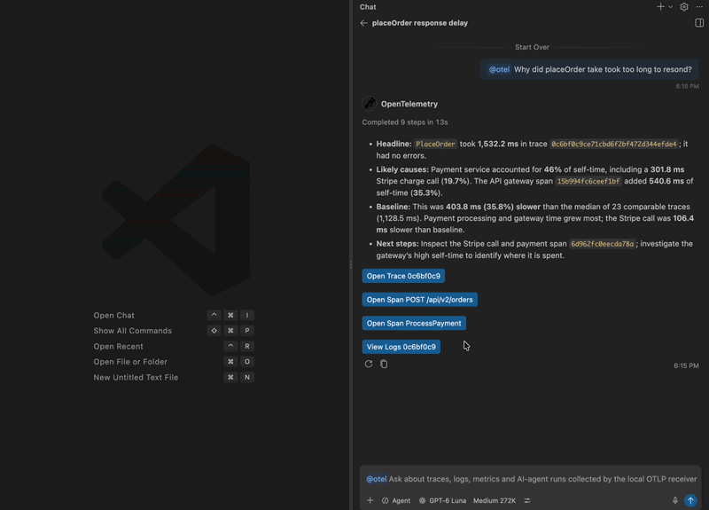
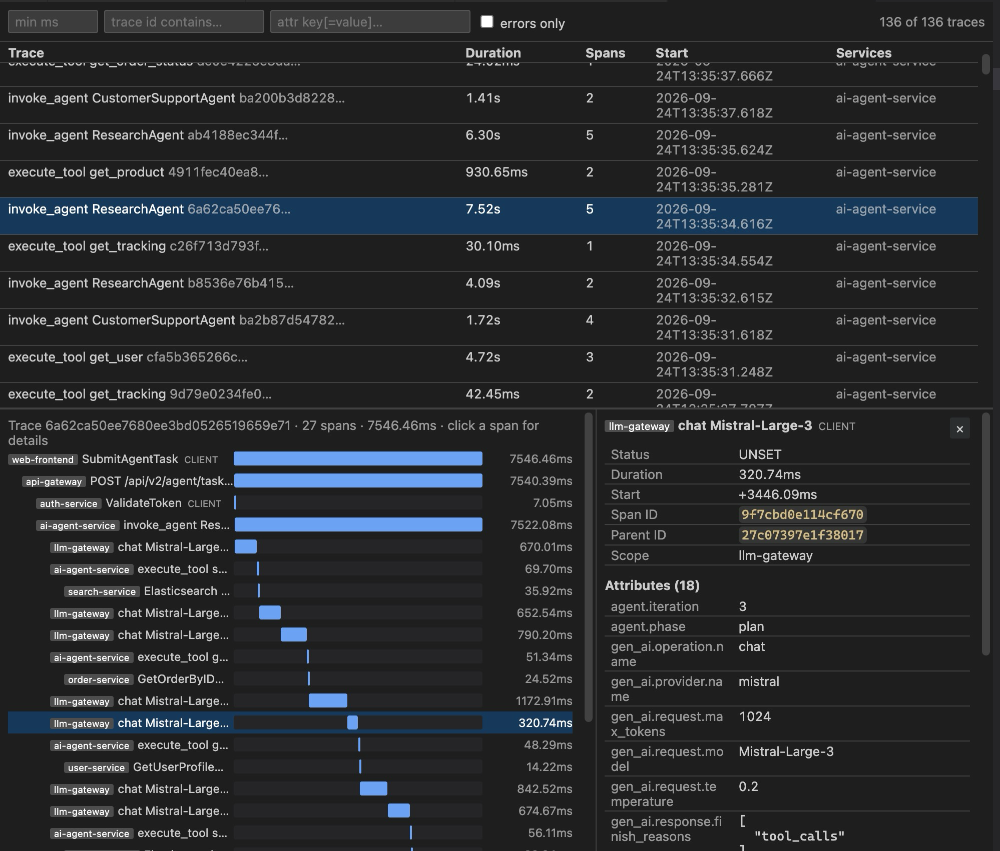
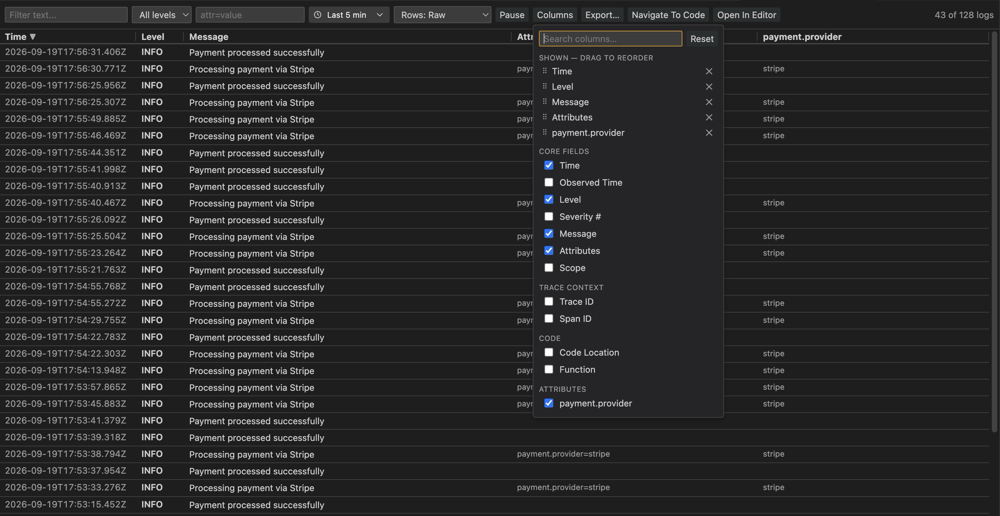
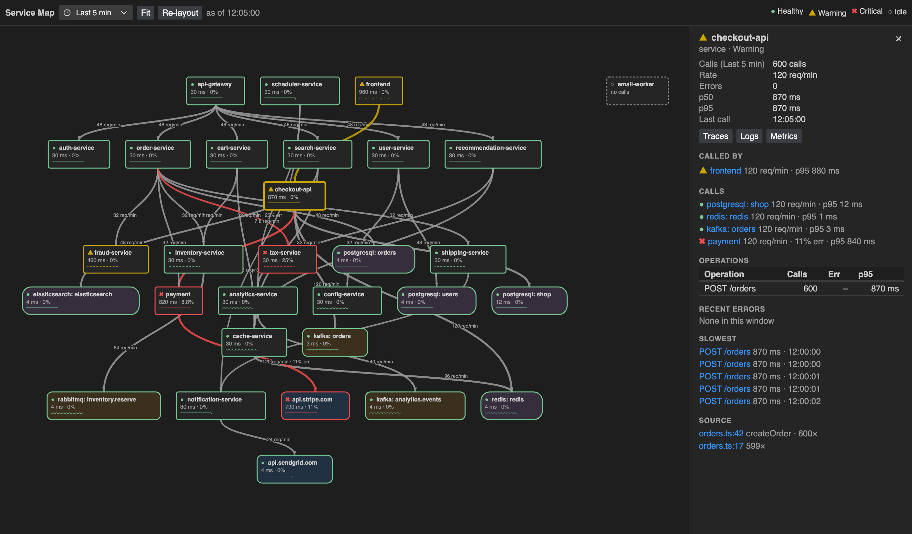
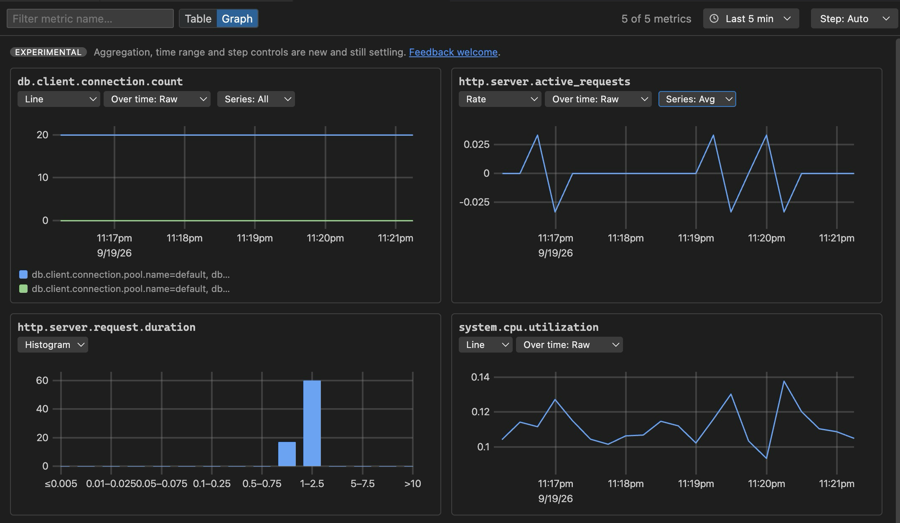
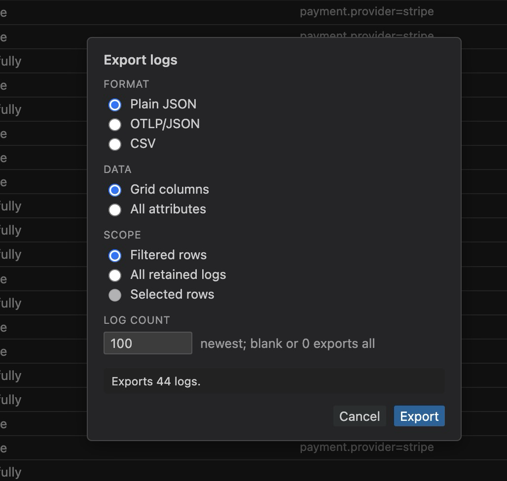

# OpenTelemetry for VS Code

**OpenTelemetry debugging without leaving VS Code, with optional AI-assisted investigation.**

Capture OTLP logs, traces, and metrics with a receiver built into the editor. There is no Jaeger, Zipkin, or OpenTelemetry Collector to run. Inspect requests next to your code, jump from a span or log to its source line, see how your services connect and, if you turn it on, ask Copilot to investigate. It works whether your app is launched from VS Code or runs elsewhere, and the data stays in memory on your machine.

[](https://marketplace.visualstudio.com/items?itemName=SukantaSaha.opentelemetry)
[](https://github.com/sukanta1991/opentelemetry/actions/workflows/ci.yml)
[](./LICENSE)



## Why this extension?

Looking at telemetry during development usually means running a Collector and a backend, then switching between the browser and your editor. This extension moves that first round of investigation into VS Code.

```text
Typical local setup
  your app → OpenTelemetry SDK → Collector → Jaeger / Grafana → browser → back to VS Code

With this extension
  your app → OpenTelemetry SDK → VS Code
```

- Inspect traces while you debug your application.
- Search and filter logs without leaving the editor.
- Explore metrics per service instance.
- See the services, databases, and queues a request touches.
- Jump from a span or log straight to the source line.
- Export logs to share or analyse elsewhere.
- Optionally ask Copilot why a request was slow or failed.

## When should I use this?

Use it when you are:

- developing an instrumented application locally,
- debugging a request that crosses several services,
- adding or testing OpenTelemetry instrumentation,
- checking performance before telemetry reaches your production systems.

It is not a production observability platform. Data lives in memory and is bounded by the `otel.retention.*` settings. For production, keep using your OpenTelemetry Collector and
observability backend. You can also send data to both at once (see [Apps running outside VS Code](#apps-running-outside-vs-code)).

## Features at a glance

### Traces

- Sortable trace list with filters and a query bar, e.g. `service=checkout status=error dur>200ms`.
- A waterfall that merges spans from every instance, with each span's logs shown on its bar.
- Span details: attributes, events and exceptions, links, logs, and resource.
- Find a trace by ID or by a W3C `traceparent` pasted from your terminal.

### Logs

- A virtualized table with text, level, attribute, and time-range filters.
- A column picker, including any log attribute as its own sortable column.
- Jump from a log to its trace, or to the source line.
- Export to OTLP/JSON, JSON, or CSV, and import OTLP/JSON or JSON Lines.

### Metrics

- Gauges, counters and sums, histograms, and summaries per instance.
- A table or graph view, with chart type, over-time aggregation, and series roll-up per metric.
- Choose local time or UTC for timestamps in Logs and Traces and on metric chart axes with the `otel.useLocalTime` setting; local time is the default.

### Service map

- Services, databases, queues, and external dependencies inferred from spans, laid out top-down from callers to callees.
- Live health per service and call: p95 latency, error rate, req/min, and a sparkline, coloured by configurable thresholds.
- Click a service to open its traces, logs, metrics, slowest and failing traces, and source files.

### OTLP receiver

- OTLP/gRPC on `4317` and OTLP/HTTP (protobuf and JSON) on `4318`, bound to `127.0.0.1`.
- The endpoint is injected automatically into apps you run or debug from VS Code.
- Copy the endpoint, environment variables, or a per-language snippet for apps run elsewhere.
- An **Instances** tree groups apps by `service.name`.
- Works with any OTLP SDK: **Java, .NET, Go, Node.js, Python, Rust**, and others.

### AI investigation (optional, off by default)

- The `@otel` chat participant with `/slow`, `/errors`, and `/agent`.
- Nine read-only `otel_*` tools for Copilot agent mode.
- Answers cite trace and span IDs, with buttons back to the data.

See [Features in depth](#features-in-depth) for the full list.

## Screenshots

**Traces and spans:** find slow or failing requests, open one as a waterfall of spans across every service it touched, and inspect a span's status, IDs, and attributes in the details pane:



**Logs:** search and filter, choose which columns to show (including any attribute promoted to its own sortable column), then jump straight to the source line:



**Service map:** a live dependency map with p95 latency, error rate, and req/min per service and call. Click a node for its traces, logs, metrics, and source files:



**Metrics:** the **Graph** view renders each metric as a chart, with per-graph dropdowns for the chart type, the **Over time** aggregation, and the **Series** roll-up, plus a shared time range and step:



Export the rows you care about as OTLP/JSON, plain JSON, or CSV, picking the columns, the record count, and whether to export the filtered, all, or selected rows:



## Getting started

1. **Install** from the Extensions view (search “OpenTelemetry”), or from a terminal:

   ```bash
   code --install-extension SukantaSaha.opentelemetry
   ```

2. Open the **OpenTelemetry** view in the Activity Bar and click **Start receiver** (or start it from the status bar item). The status bar then shows the active gRPC and HTTP ports.

3. Point your application's OTLP exporter at the receiver. Its instance, logs, traces, and metrics appear as data arrives.

### Apps launched from VS Code

When you run or debug an app from VS Code, the extension automatically injects the `OTEL_EXPORTER_OTLP_ENDPOINT` environment variable so a configured OTLP exporter sends data to the receiver. You can disable this with the `otel.overwriteEnvVars` setting.

### Apps running outside VS Code

Point the exporter at the receiver yourself. Use the **OpenTelemetry: Copy OTLP Endpoint** or **Copy OTLP Endpoint Environment Variable** commands (or **Show Instrumentation Snippet** for a per-language example), then set:

```bash
export OTEL_EXPORTER_OTLP_ENDPOINT="http://127.0.0.1:4317"
export OTEL_EXPORTER_OTLP_PROTOCOL="grpc"
```

You can also route data through an [OpenTelemetry Collector](https://opentelemetry.io/docs/collector/) by adding the receiver as an OTLP exporter target.

## Common workflows

**Debug a failing request**

1. Start your app and generate some traffic.
2. Open **Traces** and set **status** to *Error* (or type `status=error dur>200ms` in the query bar).
3. Select the failed trace to open its waterfall. Log markers on the bars show where logs were written; click one, or a span, to see its attributes, events, links and logs in the details pane.
4. Click **View logs** to open Logs filtered to that span (or **View logs for trace** for the whole request), then **Navigate To Code** to jump to the source.

Going the other way works too: select a log and click **View Trace** (or click its Trace ID) to open the waterfall with the log's span selected. **OpenTelemetry: Find Trace by ID** accepts a trace ID or a W3C `traceparent` pasted from your terminal.

**Share a reproduced bug (traces, logs and metrics)**

1. Reproduce the problem with the receiver running.
2. Click **Save Session…** in the Instances view toolbar. To save less, use **Save Instance…** on an instance, or right-click a trace in the Traces panel and choose **Export Trace…** to get that trace and its correlated logs.
3. Your teammate runs **OpenTelemetry: Load Session…**. The file opens under **Imported**, and the waterfall, logs, metrics charts and service map all work. A loaded file is kept separate from live data and from other files, so the same trace never shows twice.

**Open CI or Collector output**: **Load Session…** also accepts a bare OTLP/JSON request, or the JSON Lines written by the OpenTelemetry Collector `file` exporter.

**Share a log sample with a teammate**

1. Open **Logs** and narrow the table with the search, level, attribute, and time-range controls.
2. Optionally select specific rows (Cmd/Ctrl+click, or Shift+click for a range).
3. Click **Export**, pick a format and scope, and save the file.
4. Your teammate runs **OpenTelemetry: Import Logs From File** to open it under **Imported** — read-only, retention-exempt, and unaffected by **Clear Collected Data**.

**Bring in logs from another vendor**

1. Export logs from your log platform as JSON Lines (one JSON object per line, `.jsonl`/`.ndjson`).
2. Run **OpenTelemetry: Import Logs From File** and pick the file.
3. Nested objects are flattened to dotted attribute keys, and the timestamp, severity, message, trace/span ids, scope, and service name are recognised from common field names — epochs in seconds, milliseconds, microseconds, or nanoseconds are all detected automatically. Unreadable lines are skipped and counted rather than failing the whole import.

**Understand what a service talks to**

1. Generate distributed traffic (HTTP calls, database queries, queue messages).
2. Open the **Service Map** to see services, databases, and queues and how they connect.

## Privacy and data handling

The extension is built for local development. It has no backend and makes no outbound network calls of its own. Its only network activity is the OTLP receiver listening for your apps.

```text
your app ── OTLP ──▶ 127.0.0.1:4317 (gRPC) / 127.0.0.1:4318 (HTTP) ──▶ in-memory store in VS Code
```

**Telemetry**

- The receiver binds to `127.0.0.1` by default. Setting `otel.host` to another address exposes your telemetry to that network.
- Live telemetry is held in memory only. It is capped by the `otel.retention.*` settings and dropped when the receiver restarts or you run **Clear Collected Data**.
- Telemetry is never written to disk unless you export it yourself.

**AI features (optional)**

AI access is off until you enable the `otel.ai.enabled` user setting. When you ask a question:

```text
@otel or an agent-mode request asks for an otel_* tool
        │  VS Code asks you to confirm the call (or you chose "always allow")
        ▼
read-only query over the in-memory telemetry, capped in size
        │
        ▼
redaction: secrets masked, AI prompt/completion text removed
        │
        ▼
the chat model you selected in VS Code ──▶ answer shown in chat
```

| The `otel_*` tools can | The `otel_*` tools cannot |
| --- | --- |
| Read the telemetry the receiver holds in memory | Read, create or edit workspace files |
| Read the `otel.ai.*` settings | Run commands, tasks or terminals |
| | Read environment variables |
| | Make network requests |
| | Change or delete telemetry |

Buttons in `@otel` answers only open a trace, its logs, or a source line, and only when you click them. Source lines go through the same path checks as **Navigate To Code**. In agent mode, any other tools the agent has, such as file edits or the terminal, come from VS Code or other extensions, not from this one.

- **Opt-in and confirmed.** Nothing is read until you enable `otel.ai.enabled`, and VS Code asks before each tool call. You can choose to always allow a tool. A workspace `settings.json` cannot turn it on.
- **Your model, your choice.** Results go only to the language model selected in the chat model picker. That includes bring-your-own-key and local models (for example Ollama) configured in VS Code. The extension stores no API keys.
- **Redacted first.** Before anything is sent:
  - Values of keys such as `authorization`, `cookie`, `password`, `token`, `secret`, API keys and connection strings are masked.
  - Bearer/Basic credentials, JWTs, AWS, GitHub, Slack and `sk-` keys, private keys, URL passwords and `password=` pairs are masked in any text.
  - You can add keys with `otel.ai.redactAttributeKeys`, but never remove the built-in ones.
  - Prompt and completion text from AI-agent spans (`gen_ai.prompt`, `gen_ai.input.messages`, …) is never sent, only its length.
- **Bounded.** Each result is capped at `otel.ai.maxResultItems` items and 24,000 characters.
- **Transparent.** Open the **OpenTelemetry AI** output channel and set its log level to **Debug** (gear icon → Set Log Level) to see the exact text sent for every call.
- **Telemetry is treated as untrusted.** The model is told never to follow instructions found in telemetry, and buttons are built only from IDs the extension validated, never from text the model wrote.

To report a vulnerability, see [SECURITY.md](./SECURITY.md).

## How it fits with other observability tools

This extension doesn't replace a production observability platform. It is built for the develop-and-debug loop on your own machine.

| | OpenTelemetry for VS Code | Jaeger | Grafana with Tempo, Loki and Prometheus |
| --- | --- | --- | --- |
| Where it runs | Inside VS Code | Separate service with a web UI | Separate services with a web UI |
| Local setup | Install the extension, start the receiver | Run a container or binary | Run several containers, or an all-in-one image |
| Accepts OTLP | Yes (gRPC and HTTP) | Yes | Yes |
| Traces | Yes | Yes | Yes (Tempo) |
| Logs | Yes | No | Yes (Loki) |
| Metrics | Yes | Span-derived only (Monitor tab) | Yes (Prometheus) |
| Service map | Yes | Yes | Yes (Tempo service graphs) |
| Open a span's or log's source line in your editor | Yes | No | No |
| Automatic persistent storage | No; live data is in memory, with manual export/import available | Yes | Yes |
| Production scale and long retention | No | Yes | Yes |
| Alerting and shared dashboards | No | No | Yes |

*Based on each project's public documentation as of September 2026. Features change, so if something here is out of date, please [open an issue](https://github.com/sukanta1991/opentelemetry/issues).*

A common setup is to keep your Collector and backend for shared and production telemetry, and add this extension as a second OTLP exporter target while you develop.

## Ask Copilot about your telemetry

Ask questions in chat such as *"why is my slowest request slow?"* or *"what did my AI agent spend its time on?"*. The answers are computed from the data the receiver holds, and each one comes with buttons that open the trace, span, logs or source line it refers to.

**Turn it on.** AI access is **off by default**. Enable the `otel.ai.enabled` **user** setting (Settings → search "otel.ai"). A workspace `settings.json` cannot turn it on, so a cloned repository can't enable it for you.

**Use `@otel` in chat:**

| Ask | What happens |
| --- | --- |
| `@otel why is my slowest request slow?` | Finds the request, walks its critical path, compares it with similar requests and cites trace and span IDs. |
| `@otel /slow` | Finds the slowest recent request and explains where the time went. |
| `@otel /errors` | Groups recent failing requests by endpoint and explains the top failure. |
| `@otel /agent` | Summarizes the latest AI-agent run: LLM vs. tool time, token usage, slowest and failed tools. |

**In agent mode**, or with any chat participant, reference the tools directly with `#`, e.g. *"#otelTraces show failing checkout requests from the last 10 minutes"*.

| Tool | Reference | Returns |
| --- | --- | --- |
| `otel_listServices` | `#otelServices` | Applications, instances and what each holds |
| `otel_searchTraces` | `#otelTraces` | Traces matching the [trace query syntax](#trace-query-syntax), listed or grouped (by root, service, time or a root attribute), with p50/p95 and error rate |
| `otel_findSpans` | `#otelSpans` | Spans across recent traces with self-time, optionally grouped by service and name |
| `otel_getTrace` | `#otelTrace` | One trace: critical path, top self-time spans, errors, time per service, correlated logs |
| `otel_compareTraces` | `#otelCompare` | Where a trace spent more time than a baseline (explicit or the median of similar traces) |
| `otel_queryLogs` | `#otelLogs` | Logs by service, severity, text, trace or time, newest first |
| `otel_queryMetrics` | `#otelMetrics` | Metric list, or per-series last/min/max/avg/p50/p95 and counter rates |
| `otel_getServiceMap` | `#otelServiceMap` | Service dependencies with call counts and error rates |
| `otel_genAiSummary` | `#otelAgent` | An AI-agent trace (OpenTelemetry `gen_ai.*` conventions): time split, tokens per model, slowest and failed calls |

**Privacy.** The tools are read-only, each call is confirmed, and results are redacted before they reach the model you selected. See [Privacy and data handling](#privacy-and-data-handling) for exactly what is sent.

**Limits.** Answers only cover what is still in the in-memory buffers. Older data may have been evicted (see the `otel.retention.*` settings), and span searches look at the newest 1000 traces. Requires VS Code 1.95 or later, and a chat model that supports tool calling.

## Features in depth

- **Embedded OTLP receiver** — accepts **OTLP/gRPC** (default `4317`) and **OTLP/HTTP** (protobuf + JSON, default `4318`).
- **Logs** — a virtualized table that stays responsive at full retention:
  - **Search and filter** by text, minimum level, and `attr=value`.
  - **Time range picker** (1 min … 2 hour, or **All logs**) anchored to the newest log received, so rows stay visible after the emitting app stops. A hint appears when retention holds less history than the selected window.
  - **Columns** button to choose which of Time, Observed Time, Level, Severity #, Message, Attributes, Scope, Trace ID, Span ID, Code Location and Function are shown — plus any
    **individual log attribute** promoted to its own sortable column. Drag to reorder, search the list, or reset to defaults.
  - **Resizable columns** — drag any edge, or double-click it to fit the content.
  - **Row height** modes: Raw (full wrap), 1 line, 2 lines, and Condensed.
  - **Sorting** by Time, Observed Time, Severity, or an attribute column. Newest first by default.
  - **Pause** freezes the view while logs keep arriving in the background, showing how many are queued.
  - **Multi-select** with Cmd/Ctrl+click, Shift+click ranges, and Cmd/Ctrl+A, with an optional selection checkbox column.
  - **Export** to OTLP/JSON, plain JSON, or CSV — choosing the visible columns or all attributes, a record count, and whether to export the filtered, all, or selected rows.
  - **Import** OTLP/JSON, JSON Lines (`.jsonl`/`.ndjson`) or previously exported plain JSON as a read-only instance under the **Imported** node, kept separate from live telemetry.
  - **Navigate To Code** to jump to the source line, and **Open In Editor** to view a log as JSON.
  - **View Trace** (or click a Trace ID / Span ID cell) opens the log's trace waterfall with its span selected. Arriving from a trace filters Logs to that trace or span — shown as a chip you can clear — and ignores the time range so older correlated logs stay visible.
- **Traces & spans** — a virtualized, sortable trace list with a column picker (including root-span attributes as columns) and the same time-range picker as Logs:
  - **Filters** for service, span name, status, kind, span attributes (`key` / `key=value`), min/max duration and trace ID, plus an **advanced query bar** (see [Trace query syntax](#trace-query-syntax)). Span conditions must all hold on the **same span**.
  - The **waterfall** merges distributed spans from every instance by trace ID and shows each span's **logs as markers** on its bar (coloured by severity, grouped when dense; logs outside the span's time are pinned to its edge and flagged). Logs with the trace ID but no known span appear in a trace-level strip. Large traces are virtualized.
  - The **span details** pane shows status, IDs, attributes, events (including exception stack traces), **links** (open a linked trace, then **Back**), the span's **logs** (each with **Open in Logs**), and the **resource**. **View logs** opens Logs filtered to the span, and **Navigate To Code** appears when the span has `code.*` attributes.
  - The open waterfall refreshes live as spans and logs arrive.
- **Metrics** — per-instance gauges, counters/sums, and histograms with a **Table | Graph** toggle. The Graph view plots time-series history built up as telemetry streams in:
  - **Gauges & sums** → multi-series line charts (one line per attribute set), on a shared time axis.
  - **Summaries** → a line per quantile.
  - **Histograms** → bar charts of the latest bucket distribution.
  - A **per-graph chart-type dropdown** offers views scoped to each metric's OTEL type — counters and updown-counters add **rate**, **stacked-area**, **area**, and **bar** (for updown-counters `rate` keeps real increases and decreases); gauges add a single-value **gauge** readout; summaries add a **percentile** view; every type offers **table**. The selection is remembered per metric across panel reopens.
  - An **Over time** dropdown aggregates each series into fixed-width time buckets (avg / min / max / sum / last / count / std-dev / P50 / P90 / P95 / P99), reshaping the plotted line rather than adding a readout; **Raw** plots every sample. Multi-series scalar metrics also get a **Series** dropdown (sum / avg / min / max / P95 across label sets).
  - A **time-range picker** in the toolbar (1 min … 2 hour) applies to every graph at once and pins the x-axis to the selected window, alongside a **Step** control for the aggregation bucket width. **Auto** follows the range; pick a coarser step to gather several samples per bucket. The width actually used is shown beside the Over time dropdown. A hint appears when the retained history is shorter than the chosen range.
  - ⚠️ The aggregation, time-range and step controls are **experimental** while we gather feedback — their defaults and behaviour may change. Please report anything surprising at [github.com/sukanta1991/opentelemetry/issues](https://github.com/sukanta1991/opentelemetry/issues).
  - Charts use VS Code theme colors, abbreviate large axis values (e.g. `270k`, `2.8M`), and truncate long series labels with a full-text tooltip on hover. History depth is bounded by `otel.retention.maxMetricPointsPerSeries`.
- **Service map** — a live dependency map of services, databases, queues, and external dependencies inferred from spans:
  - **Layout:** callers above callees; cycles are drawn as curved back-edges and very wide layers wrap. **Fit**, **Re-layout**, mouse-wheel zoom, and drag to pan.
  - **Time window** (1 min … 2 hours, or all retained data), measured back from the newest span like the Traces and Logs panels. Edges show **req/min** for a window or the call count for *All*. A **partial window** badge appears when less data is retained or received than the window asks for; rates use the shorter span.
  - **Health:** each service, dependency, and call is **Healthy ●**, **Warning ▲**, **Critical ✖**, or **Idle ○** (no calls in the window), from the worse of its error rate and p95 latency against the `otel.serviceMap.*` thresholds. Fewer than 5 calls show at most a warning. Service latency is measured on the spans that enter the service; call latency is what the caller saw.
  - **Details:** click (or Tab + Enter) a node or edge for its stats, callers and callees, top operations, recent errors, slowest traces, and source files (`code.*` attributes). Services also get **Traces / Logs / Metrics** buttons (a picker appears when there are several instances). Esc closes the panel.
  - Rates and latencies come from the spans still in memory, so they are bounded by `otel.retention.maxTracesPerInstance`. Maps with more than 250 nodes hide the least-called dependencies.
- **Instances tree** — applications grouped by `service.name`, each with its own instances.
- **Ask Copilot** (opt-in) — the `@otel` chat participant and nine `otel_*` tools answer questions about your traces, logs, metrics and AI-agent runs, with buttons back to the data. See [Ask Copilot about your telemetry](#ask-copilot-about-your-telemetry).

## Trace query syntax

The Traces query bar combines with the toolbar filters; every term must match. Terms are separated by spaces (or commas); quote values containing spaces, e.g. `name="GET /api"`.

| Term | Matches |
| --- | --- |
| `service=checkout`, `service!=checkout` | Span's service (case-insensitive) |
| `name:users`, `name="SELECT users"`, `name!=…` | Span name contains / equals |
| `status=error` / `ok` / `unset` | Span status |
| `kind=server` / `client` / `internal` / `producer` / `consumer` | Span kind |
| `http.route=/api`, `key:value` | Attribute contains the text (case-insensitive) |
| `key!=value` | Attribute does not contain the text (spans without it also match) |
| `http.status_code>=500`, `>`, `<`, `<=` | Numeric attribute comparison |
| `has:key` or a dotted `db.system` | Attribute is present |
| `-key` | Attribute is absent |
| `dur>200ms`, `dur<1.5s` (`us`, `ms`, `s`, `m`, `h`) | Trace duration |
| `trace:4bf92f` | Trace ID contains |
| any other word, or `"a phrase"` | A span name or the trace ID contains it |

**Span terms must all hold on the same span**: `service=checkout status=error` finds traces where a checkout span failed, not traces where checkout ran and something else failed. Queries are limited to 1000 characters and 20 terms; unrecognised terms are listed and ignored.

## Commands

| Command | Description |
| --- | --- |
| `OpenTelemetry: Start / Stop / Restart Receiver` | Control the embedded OTLP receiver. |
| `OpenTelemetry: Clear Collected Data` | Drop all in-memory telemetry. |
| `OpenTelemetry: Copy OTLP Endpoint` | Copy the gRPC or HTTP endpoint. |
| `OpenTelemetry: Copy OTLP Endpoint Environment Variable` | Copy `OTEL_EXPORTER_OTLP_ENDPOINT=…`. |
| `OpenTelemetry: Open Terminal With OTLP Environment` | New terminal pre-set with the OTLP env vars. |
| `OpenTelemetry: Show Instrumentation Snippet` | Per-language exporter snippets (Node/Python/Go/.NET/Java). |
| `OpenTelemetry: Open Logs / Traces / Metrics` | Open a panel for the selected instance. |
| `OpenTelemetry: Export Logs` | Export logs as OTLP/JSON, plain JSON, or CSV. |
| `OpenTelemetry: Import Logs From File` | Load an OTLP/JSON, JSON Lines (`.jsonl`/`.ndjson`) or exported plain JSON file as a read-only instance. |
| `OpenTelemetry: Save Session…` | Save all traces, logs and metrics to one `.otel.json` file. Each section is an OTLP `Export*ServiceRequest`. |
| `OpenTelemetry: Load Session…` | Load a saved session, an OTLP/JSON request, or Collector file-exporter JSON Lines under **Imported**. |
| `OpenTelemetry: Save Instance…` | Save one instance's traces, logs and metrics. |
| `OpenTelemetry: Open Service Map` | Show the live service dependency map. |
| `OpenTelemetry: Find Trace by ID` | Open a trace's waterfall from a trace ID or W3C `traceparent`. |

Instances in the tree also expose inline **Logs / Traces / Metrics** icons and a **Remove Instance** action. Right-click a trace in the Traces panel for **Export Trace…**.

## Settings

| Setting | Default | Description |
| --- | --- | --- |
| `otel.launchOnStartup` | `false` | Start the receiver when VS Code starts. |
| `otel.port.mode` | `fixed` | `fixed` or `random` port assignment. |
| `otel.port.grpc` | `4317` | OTLP/gRPC port (fixed mode). |
| `otel.port.http` | `4318` | OTLP/HTTP port (fixed mode). |
| `otel.host` | `127.0.0.1` | Bind address. Binding beyond localhost exposes telemetry. |
| `otel.overwriteEnvVars` | `true` | Inject the OTLP endpoint into launch/debug configs. |
| `otel.useLocalTime` | `true` | Show Logs, Traces, and metric chart timestamps in your local timezone instead of UTC. |
| `otel.retention.maxLogsPerInstance` | `5000` | Log retention cap per instance. |
| `otel.retention.maxTracesPerInstance` | `2000` | Trace retention cap per instance. |
| `otel.retention.maxMetricPointsPerSeries` | `500` | Metric time-series points retained per series (controls graph history depth). |
| `otel.import.maxFileSize` | `200` | Largest file (MB) accepted by **Import Logs** or **Load Session**. Checked before the file is read. |
| `otel.import.maxRecords` | `50000` | Most records (spans, logs and metric points) accepted from one import or session. Imported data bypasses retention, so this bounds its memory use. |
| `otel.serviceMap.latencyWarnMs` | `300` | Service map: p95 latency (ms) at or above which a node or call shows a warning. |
| `otel.serviceMap.latencyCriticalMs` | `1000` | Service map: p95 latency (ms) at or above which a node or call is critical. |
| `otel.serviceMap.errorRateWarn` | `0.01` | Service map: error rate (0–1) at or above which a node or call shows a warning. |
| `otel.serviceMap.errorRateCritical` | `0.05` | Service map: error rate (0–1) at or above which a node or call is critical. |
| `otel.ai.enabled` | `false` | Let Copilot and `@otel` read collected telemetry through the `otel_*` tools. User setting only. |
| `otel.ai.redactAttributeKeys` | `[]` | Extra attribute keys to mask before data is sent to a model (added to the built-in list). |
| `otel.ai.maxResultItems` | `25` | Most items (traces, spans, logs, series, …) one AI tool call may return (1–200). |

Example `settings.json`:

```json
{
  "otel.launchOnStartup": true,
  "otel.port.mode": "fixed",
  "otel.port.grpc": 4317,
  "otel.port.http": 4318
}
```

## Troubleshooting

### The Instances view says the receiver isn't running

The receiver does not start automatically by default. Click **Start receiver** in the Instances view (or the status bar), or set `otel.launchOnStartup` to `true` to start it whenever VS Code launches.

### "Port already in use"

If the configured port is busy, the extension reports the error and offers to retry on randomly assigned ports. You can also set `otel.port.mode` to `random`, or change `otel.port.grpc` / `otel.port.http` to free ports.

### No telemetry appears

- Confirm the exporter endpoint matches the receiver: **gRPC** uses `4317`, **HTTP** uses `4318`. Set `OTEL_EXPORTER_OTLP_PROTOCOL` (`grpc` or `http/protobuf`) accordingly.
- For apps launched from VS Code, make sure `otel.overwriteEnvVars` is `true`.
- For external apps, copy the endpoint with **OpenTelemetry: Copy OTLP Endpoint** and verify your SDK is actually exporting.

> **Note:** the receiver binds to `127.0.0.1` by default. A firewall prompt may appear the first time it starts.

### "Navigate To Code" doesn't jump anywhere

Navigate To Code applies to **log entries** and **spans** and requires source-location attributes (`code.filepath` / `code.lineno`, or the newer `code.file.path` / `code.line.number`). If those attributes aren't present, the action is unavailable. It also can't navigate to third-party or decompiled code.

Paths are resolved inside your workspace folders; when only a file name matches, the closest path wins (or you pick from a list). Because telemetry can come from any process, an absolute path **outside** the workspace asks for confirmation before it is opened.

### "Trace is not in collected data"

**View Trace** and **Find Trace by ID** can only open traces the receiver has received and still retains. The trace may not have been exported (sampling, a missing exporter), may have been evicted by `otel.retention.maxTracesPerInstance`, or the log may come from an imported file.

### My collected data disappeared

Live telemetry is stored **in memory** and is cleared when the receiver restarts or when you run **Clear Collected Data**. To keep a copy, click **Save Session…** and load the file again later with **Load Session…**. Loaded data survives **Clear Collected Data** and is removed only when you remove it.

### The settings gear opens an empty page

This was fixed in `0.1.2`. Update to the latest version, or open settings manually and search for “OpenTelemetry”.

### Reporting a problem

See [SUPPORT.md](./SUPPORT.md) for what to include in a bug report. Remove secrets and sensitive telemetry before attaching logs. Report security issues privately as described in [SECURITY.md](./SECURITY.md), not in a public issue.

## Roadmap

Planned and under exploration — feedback welcome via [issues](https://github.com/sukanta1991/opentelemetry/issues):

- Restore the last session automatically when VS Code reopens

## Contributing

Issues and pull requests are welcome at [github.com/sukanta1991/opentelemetry](https://github.com/sukanta1991/opentelemetry). Please read [`CONTRIBUTING.md`](./CONTRIBUTING.md) and our [`CODE_OF_CONDUCT.md`](./CODE_OF_CONDUCT.md) first. See [`CHANGELOG.md`](./CHANGELOG.md) for release notes.

For contributors, from a clone:

```bash
npm install
npm run build     # bundle with esbuild
npm run typecheck # type-check
npm run lint      # eslint
npm test          # unit + smoke + activation tests
npm run package   # produce a .vsix
```

To try trace ↔ log correlation without an instrumented app, start the receiver and run `npx ts-node test/scripts/push-correlated.ts` (add `--bulk` for 2000 traces × 50 spans). For `@otel /agent`, run `npm run push:genai` to send a sample AI-agent trace.

Press **F5** to launch the Extension Development Host.

CI type-checks, lints, and runs the unit, receiver smoke, and activation tests on Linux, macOS, and Windows for every pull request.
  
  ## Top Contributors
  
  <a href="https://github.com/sukanta1991/opentelemetry/graphs/contributors">
    
  </a>

## License

[Apache License 2.0](./LICENSE) © The OpenTelemetry for VS Code Authors. See [NOTICE](./NOTICE) for attributions.

Versions before 1.0.0 were released under the MIT License.
